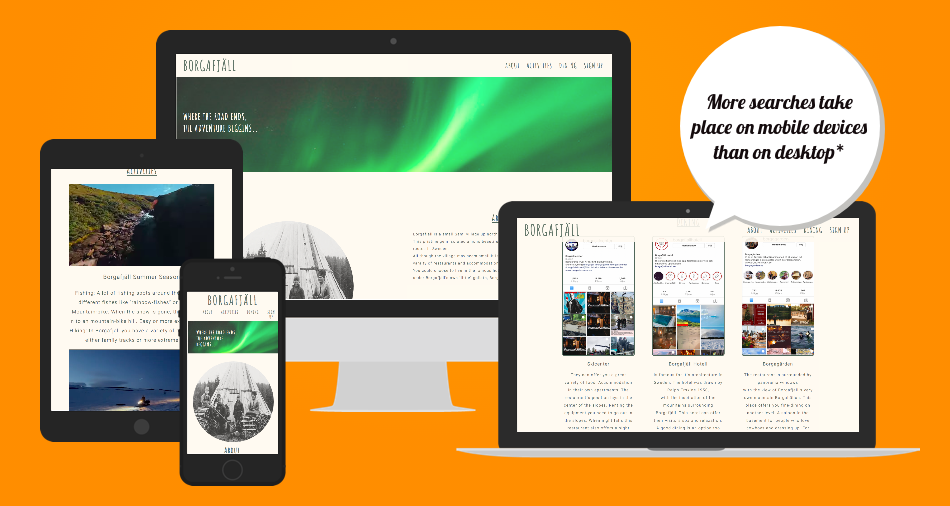
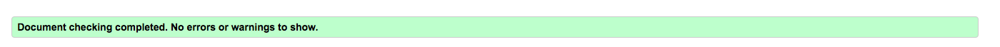
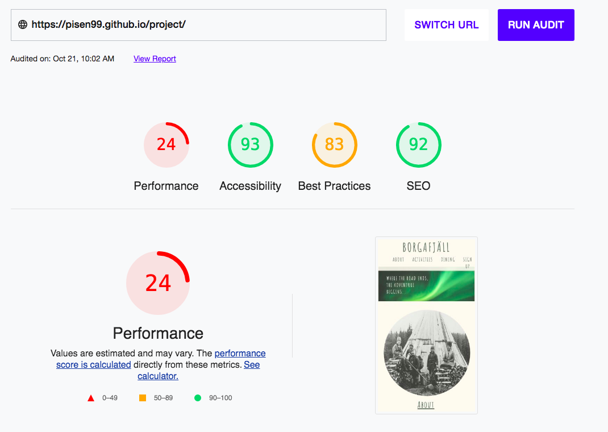

# Borgafjäll, where the road ends & the adventure beggin.

Borgafjäll is a website that reaches out to the people that has never before visited Sweden or Swedish folks that wants to discover more of it's own country.
The site is for the visitor so they can collect as much information they need about this place.
The visitor should get fast and simble facts about Borgafjäll, from activities to accomodation and dining.
Direct links to the different companies so the visitor really can get the feel for how smal this place is with a good variaty of activites to do.

## Index - table of contents

User experience
  
Features
  
Design
  
Technologies used
  
Testing
  
Credits

### A.First Time Visitor Goals
  a. As a first time visitor, I want to easily understand the websites purpose and learn more about it.
  b. As a first time visitor, I want to navigate fast and easily on the site to find what I´m looking for.
  c. As a first time visitor, I want to understand what kind of place it is, why it´s so special.
  
### B.Returning Visitor Goals
  a. As a returning visitor, I want to easily navigate to the menu to find what i´m looking for.
  b. As a returning visitor, I want to find the links easily and take me to the right place.
  c. As a returning visitor, I want to easily contact the organisation for questions or to visit.
  
### C,Frequent User Goals
  a. As a Frequent visitor, I want to be able to sign up with my email for any news of events or the weather situation.
  

## Existing Features
  
   ### F1, Navigationbar
      The navigation bar has a simple and easy navigation to it on all devices.
      It´s easy to find the different locators like "About", "Activites" "Dining" and "Sign Up".
      It lights up when the user hovers over the text, making it easier for them to see what part they might klick on.
      Making the navigation bar fixed, making it easier for people with disabilites like dyslexia.
      It´s easy to use the header as you read through the pages, taking whatever you read away and keeping you focused on where you are. 
  
  ### F2, Main image
      The main image is used to point out what vibe the site is giving out.
      Northen lights with the cover-text of "Borgafjäll, where the road ends and the adventure beggins"
      is a good way to capture the right visitor´s attention.

  ### F3, Iframe videos
      The main purpose of the two iframe videos is to show the visitor what they can discover themselves if they visit Borgafjäll.
      The beautiful nature in summer or snowmobiles riding among the mountainchain.

  ### F4, Images with a href
      three Images being used for dining section with a link connected to them.
      A direct link to instagram so the visitor can scroll and find out more about the places.
      Since the village is so small, Borgafjäll is very depended on the tourists.
      They´re needed for Borgafjäll to go around, all the companies up there have close to zero rivalty with each other.

  ### F5, Footer
      The footer contains what is needed for the visitor to take the next step.
      Booking a guide can help them with what they need to prepare before coming on this trip.
      Visitor can book it themselves, it can be challanging since there´s no airport or hospitals close in case of emergency.
      

## Design

### Imagery
      I wanted the whole page to have one common thread.
      The green in the main image goes well togheter with the other colors on the page.
      The cover-text matching the backround color (#fffaf1), the green in the image matching the menu when you hover over it.
### Dining
      images has a thin line of a green frame around them matching the rest of the text in the website.
      
### Color Scheme
      I used three colors when building the website, #fffaf1, #54655A and #80BA4D.
      
### Typography
      I wanted to use a fun font for my header, h1/h2´s and a more serious one for the text content in the rest of the page.
      The colors are soft to the eye and goes well togheter, matching the content of both summer and snow.
      
### Media query
      Making the website match on different tablets 320px, 768px and 3840px.
      I realised this practice i used was more complicated than I thought it would be.
      Unfortunatley I could not use flexbox since I didnt know how it worked.
      I realised to late that "@media screen and (max-width: ___px)" was to much for me.

## Technological used
  
### Language used,
      HTML5 
      CSS3
      
### Programs and Libraries used,
      Google fonts used to import "Roboto, sans-serif" and "Amatic SC', cursive"
      Font Awesome used to get icons in the footer
      Github/Gitpod used to save code, commits and pushes.

## Validator test
      
### HTML:

### CSS:

## Lighthouse:

## Credits

### Media
      
      Icones comes from https://fontawesome.com/

      font type comes from https://fonts.google.com/knowledge

      Used as an inspiration for structure
      https://debbie-herridge.github.io/mindfull-meditation/#how
      
      Trying to figure out where the id was for youtube
      https://www.w3schools.com/html/html_youtube.asp
      
      Tried fixing the video with a loop=1 but struggled, this video helped
      https://www.youtube.com/watch?v=4R60MFT5Yr4
      https://stackoverflow.com/questions/25779966/youtube-iframe-loop-doesnt-work
      
      Needed a reminder of how buttons work
      https://www.w3schools.com/css/css3_buttons.asp
      
      Main image where downloaded from google
      https://www.rgbstock.com/photo/mlJKVLO/Northern+Lights+over+Northern+
      
      Instagram pictures taken from my phone
      
      Youtube videos taken from my friends
      https://www.youtube.com/c/Pontus57
      https://www.youtube.com/channel/UCRRDIfe6pP0GzohFWHtkPRg
      